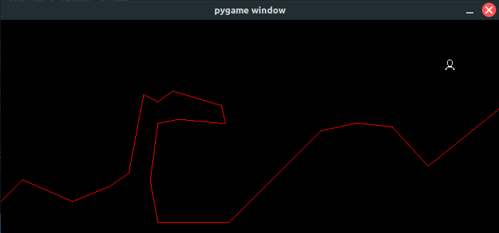

# Mars Lander

A simulator for the CodinGame puzzle Mars Lander.

## Description

I decided to make my own simulator for Mars Lander because I wanted to attempt this problem by training a neural network, and I couldn't find any other simulators that were readily available. This simulator is based on Python 3, so if you want to take the artificial intelligence route of solving this puzzle you can choose to use a framework such as TensorFlow or you could also try making your own network from scratch.

This project contains two main files, **simulator.py** and **externalCode.py**. The code you want the simulator to run should go in the **externalCode.py** file, within a class called Program with two functions, a constructor and **runTurn**. An example of a valid program is included in this repository, with a few comments to help you get started.

I tried my best effort to replicate the logic of the original puzzle, so any code placed in this file should in theory work exactly the same as on CodinGame.

You can tweak a few parameters, namely the **currentMap** and **showGame** variables in **simulator.py**. The **currentMap** variable holds the name of a file with info for a certain map. You can choose one of the ones in the maps folder or you can create your own map file by making a text file with the initial inputs for that map. The **showGame** variable allows you to show the game as it plays. If you are training a neural network, this will consume a lot of time, so I recommend you set it to False in those cases.

## Features

- **Choose from Mars Lander 1, 2 or 3!**

The simulator has eight map files, *map_a1.txt* for the Mars Lander map of the first level, *map_b1.txt* through *map_b5.txt* for the second level Mars Lander maps and *map_c1.txt* or *map_c2.txt* for the third level Mars Lander maps.

- **Watch the simulation unfold**

You can choose to watch the simulation just like on the CodinGame website, however do note that I did not add a graphic for when the lander is thrusting.

## Installation Steps

1. Download this repository.
2. Set up a [virtual environment](https://docs.python.org/3/tutorial/venv.html) with Python 3.
3. Install [pygame](https://pypi.org/project/pygame/) on your virtual environment.
4. Write the code for your lander in the **externalCode.py** file.
5. Run **simulator.py** with Python 3 to watch your code in action!

## Go check out the original games at CodinGame

The original puzzles are really cool, you can find them at the following links:

- [Episode 1](https://www.codingame.com/training/easy/mars-lander-episode-1)
- [Episode 2](https://www.codingame.com/training/medium/mars-lander-episode-2)
- [Episode 3](https://www.codingame.com/training/expert/mars-lander-episode-3)
- [Optimization](https://www.codingame.com/multiplayer/optimization/mars-lander)
